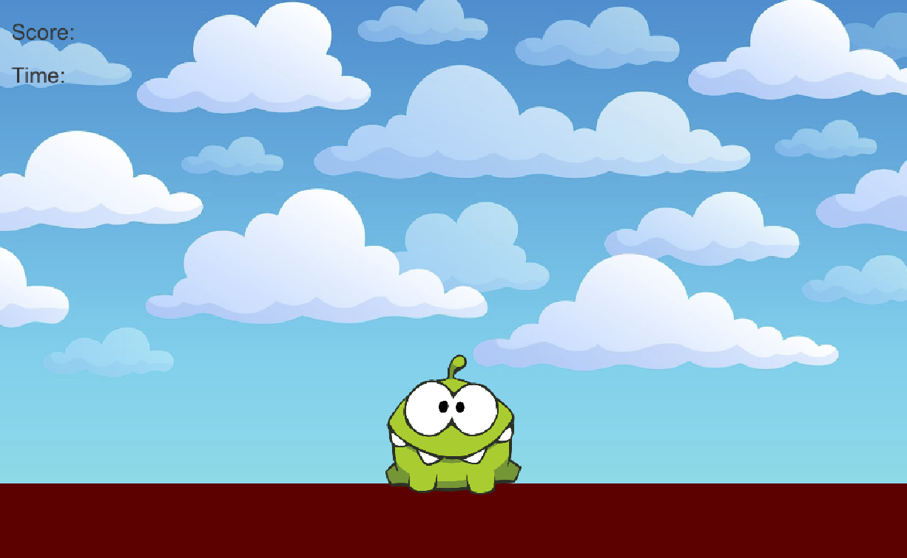

# 27CandyCatcher-schiderf

### Project description: 
Simple Candy Catcher Game for WebGl.

https://5ahmnm2122.github.io/27CandyCatcher-schiderf/

### Development platform: 
MacOS Mojave, Unity 2020 3.18f1, VisualStudio Code

### Target platform: 
WebGL 960x600

### Visuals: 

### Third party material: 
Green Candy Sprite: https://www.google.com/search?q=green%20candy%20png&tbm=isch&tbs=ic:trans&hl=de&sa=X&ved=0CAMQpwVqFwoTCJi0_L3-v_UCFQAAAAAdAAAAABAU&biw=1680&bih=805#imgrc=pzdytDC91wAzPM

Yellow Candy Sprite: https://www.google.com/search?q=yellow%20candy%20png&tbm=isch&hl=de&tbs=ic:trans&sa=X&ved=0CAMQpwVqFwoTCJDUutCBwPUCFQAAAAAdAAAAABAC&biw=1680&bih=805#imgrc=qFrOSEgjVhx5LM

Red Danger Sprite: https://www.google.com/search?q=red%20danger&tbm=isch&hl=de&tbs=ic:trans&sa=X&ved=0CAMQpwVqFwoTCKiUibSpwPUCFQAAAAAdAAAAABAC&biw=1680&bih=805#imgrc=RwGNhibxToqj_M

Monster Sprite: https://www.google.com/search?q=cut%20the%20rope%20monster%20png&tbm=isch&tbs=ic:trans&hl=de&sa=X&ved=0CAMQpwVqFwoTCLC58IGqwPUCFQAAAAAdAAAAABAC&biw=1680&bih=805#imgrc=GwszInJgKtdxnM

Background: http://clipart-library.com/clipart/1753991.htm

### Project state: 
100%

### Limitations: 
WebGL Build is not fully loading, but thanks to the issue thread i was able to overcome the problem.

### Lessons Learned: 
How to code a Timer and work with scriptable Objects.

Copyright by Schider Felix